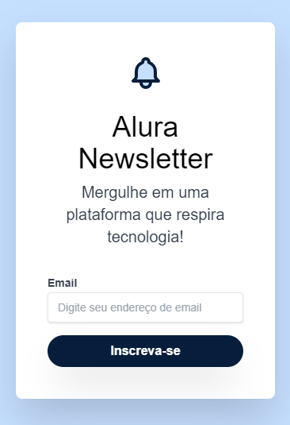
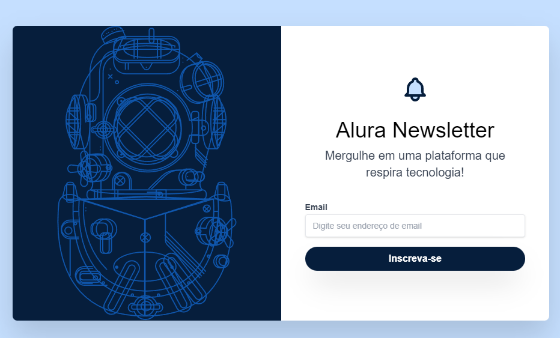

<h1 align="center">Alura Newsletter</h1>

  Projeto Alura Newsletter desenvolvido durante a formação de CSS da plataforma Alura.   
  Em conjunto com a Instrutora Beatriz Moura.

  <a href="#-tecnologias">Tecnologias</a>&nbsp;&nbsp;&nbsp;|&nbsp;&nbsp;&nbsp;
  <a href="#-projeto">Projeto</a>&nbsp;&nbsp;&nbsp;|&nbsp;&nbsp;&nbsp;
  <a href="#-acesso-ao-projeto">Acesso ao projeto</a>&nbsp;&nbsp;&nbsp;|&nbsp;&nbsp;&nbsp;
  <a href="#memo-licença">Licença</a>

  

 

  

  
  

 
 

## 🚀 Tecnologias

<li>HTML</li>
<li>CSS</li>
<li>Tailwind CSS</li>

## 💻 Projeto

  O Alura Newsletter é um site de newsletter fictício da Alura, construído durante o curso de Tailwind CSS da formação de CSS da plataforma Alura, conduzido pela Instrutora Beatriz Moura.
  Esse projeto foi criado utilizando apenas HTML e o framework Tailwind CSS que possuí um vasto e variado conjunto de classes utilitárias do CSS para a estilização de todo conteúdo. 
  Também trabalhamos as responsividade do projeto, utilizando apenas as classes adaptativas do próprio framework.

## 📁 Acesso ao projeto

Para visualizar a versão atual do projeto é só<a href="https://alura-newsletter-nu.vercel.app/"> "Clicar aqui".</a>🚀

## 👨‍💻 Autor

| [ Victor Morales](https://github.com/victor-tosto) | 
| :---: |

## :memo: Licença

Este projeto está sob a licença MIT

